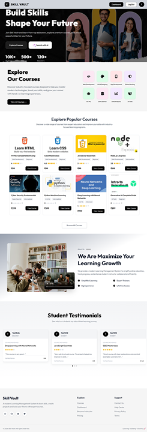
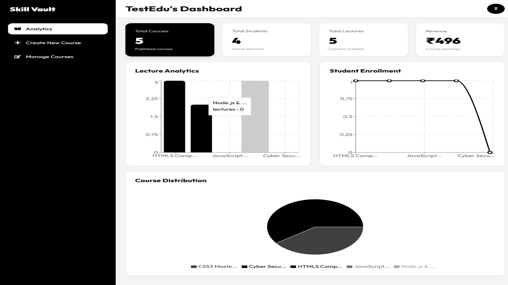
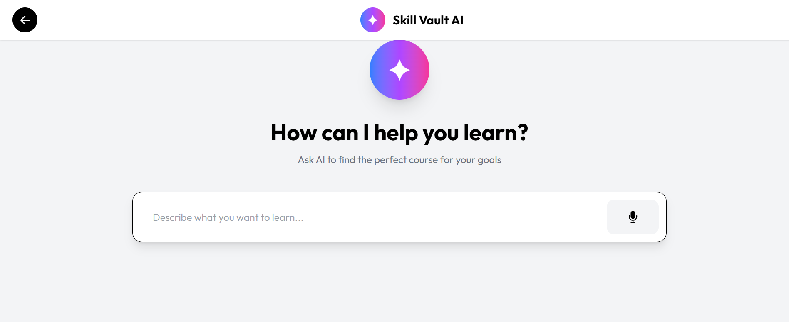

# 🚀 Skill Vault LMS

<p align="center">


</p>


<p align="center">

A modern AI-powered Learning Management System built with MERN Stack.

</p>


<p align="center">


</p>

## 🌐 Live Demo

🔗 https://skillvault-1.onrender.com/
---

# 🎬 Demo Preview


---

# 🌟 About Project


**Skill Vault** is a full-stack LMS platform where:

- Students can discover and learn courses
- Instructors can create and manage courses
- AI helps students find suitable courses based on their goals


Built with a focus on:

| Area | Description |
|-|-|
| 🎨 UI | Modern responsive LMS interface |
| 🔐 Security | JWT authentication |
| 🤖 AI | Gemini powered course search |
| ☁️ Storage | Cloudinary media upload |
| 📚 Learning | Course + lecture management |


---

# ✨ Features


## 👨‍🎓 Student Side


| Feature | Description |
|-|-|
| 🔐 Authentication | Secure login/register system |
| 🔍 Course Search | Search courses instantly |
| 🤖 AI Search | Describe your goal and get recommendations |
| 🎯 Filtering | Category, level and price filters |
| ⭐ Reviews | Rate and review courses |
| 🎥 Learning | Watch lectures online |
| 📱 Responsive | Works on all devices |


## 👨‍🏫 Instructor Side


| Feature | Description |
|-|-|
| 📚 Course Creation | Create complete courses |
| 🖼 Thumbnail Upload | Upload course images |
| 🎬 Lecture Management | Add/edit/delete lectures |
| ☁️ Video Upload | Cloud video storage |
| 📊 Dashboard | Manage courses easily |
| 🚀 Publishing | Control course visibility |


---

# 🤖 AI Course Recommendation


Skill Vault uses Gemini AI to understand user learning goals.


Example:


```
I want to learn backend development and build APIs
```


AI converts it into:


```json
{
 "category":"Web Development",
 "level":"Beginner",
 "keywords":[
   "Node.js",
   "Backend",
   "API"
 ],
 "intent":"learn"
}
```


Then courses are matched automatically.


---

# 🏗 System Architecture


```
                 USER

                  |

              React Frontend

                  |

              Express API

                  |

        ----------------------

        |                    |

     MongoDB             Cloudinary

        |

     Gemini AI

```


---

# 🛠 Tech Stack


| Technology | Usage |
|-|-|
| ⚛ React | Frontend |
| 🎨 Tailwind CSS | Styling |
| 🔄 Redux Toolkit | State Management |
| 🚦 React Router | Routing |
| 📡 Axios | API Requests |
| 🟢 Node.js | Backend |
| 🚀 Express | Server |
| 🍃 MongoDB | Database |
| ☁️ Cloudinary | Media Storage |
| 🤖 Gemini API | AI Recommendation |


---

# 📂 Project Structure


```
Skill-Vault

│
├── Backend
│
│ └── src
│ │
│ ├── config
│ │
│ ├── controller
│ │
│ ├── db
│ │
│ ├── middleware
│ │
│ ├── model
│ │
│ ├── route
│ │
│ ├── utils
│ │
│ ├── app.js
│ │
│ └── index.js


├── Frontend
│
│ └── src
│ │
│ ├── app
│ │
│ ├── assets
│ │
│ ├── componentss
│ │
│ ├── customHooks
│ │
│ ├── features
│ │
│ ├── pages
│ │
│ ├── utils
│ │
│ ├── App.jsx
│ │
│ └── main.jsx
└── README.md
```


---

# 🗄 Database Design


## User Collection


```javascript
{
 name,
 email,
 password,
 role,
 description,
 photoUrl,
 enrolledCourses
}
```


## Course Collection


```javascript
{
 title,
 subtitle,
 description,
 category,
 level,
 price,
 thumbnail,
 enrolledStudent,
 lectures,
 creator,
 reviews,
 isPublished,
 reviews
}
```


## Lecture Collection


```javascript
{
 lectureTitle,
 videoUrl,
 isPreviewFree
}
```


## Review Collection


```javascript
{
 user,
 course,
 rating,
 comment
}
```


---

# 📚 Available Categories


| Category | Icon |
|-|-|
| Web Development | 🌐 |
| AI & ML | 🤖 |
| AI Tools | ✨ |
| Data Science | 📊 |
| Data Analytics | 📈 |
| Cyber Security | 🔐 |
| Mobile Development | 📱 |
| UI UX Design | 🎨 |


---

# 🔐 Authentication Flow


```
Register

↓

Login

↓

JWT Token

↓

Protected Routes

↓

Dashboard Access

```


---

# ⚙️ Installation


## Clone


```bash
git clone https://github.com/Ankittkr/SkillVault.git
```


---

# Backend


```bash
cd backend

npm install

npm run dev

```


Environment:


```env
MONGODB_URI=
PORT=8000
JWT_SCRET=
CORS_ORIGIN=
SMTP_USER=
SMTP_PASS=
CLOUDINARY_CLOUD_NAME=
CLOUDINARY_API_SECRET=
CLOUDINARY_API_KEY=
RAZORPAY_KEY_ID=
RAZORPAY_KEY_SECRET=
GEMINI_API_KEY=

```


---

# Frontend


```bash
cd frontend

npm install

npm run dev

```
Environment:


```env
VITE_SERVER_URL=
VITE_FIREBASE_API_KEY=
VITE_RAZORPAY_KEY_ID=

```


---

# 🌐 API Overview


| Module | Endpoint |
|-|-|
| Auth | /api/v1/user |
| Courses | /api/v1/course |
| Lectures | /api/v1/course |
| AI Search | /api/v1/search/searchwithai |


---

# 📸 Screenshots

## 🏠 Landing Page

The modern landing page showcasing courses, features, and platform highlights.



## 📊 Eduactor Dashboard

A personalized dashboard where educator can manage  courses, view statistics, and access lectures.



## 🤖 AI Course Search

AI-powered search that recommends courses based on user learning requirements.


---


# 🚀 Future Roadmap


| Feature | Status |
|-|-|
| 💳 Payments | Planned |
| 🏆 Certificates | Planned |
| 📈 Progress Tracking | Planned |
| 🤖 AI Tutor | Planned |
| 🎓 Live Classes | Planned |


---

# 👨‍💻 Developer


## Ankit Kumar


Full Stack Developer


---

# ⭐ Support


If this project helped you, consider giving it a star ⭐
